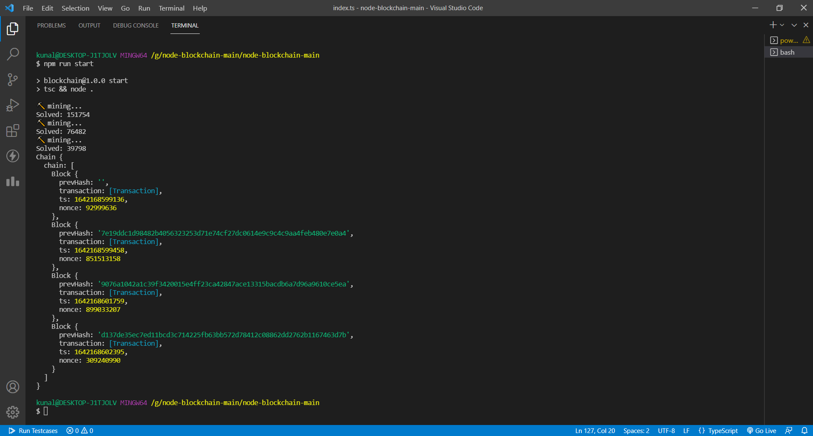

# Blockchain implemented with the help of Typescript

A simple blockchain and cryptocurrency wallet implemented in Node.js and TypeScript.



# Usage

```
git clone <this-repo>

npm install
npm start
```
